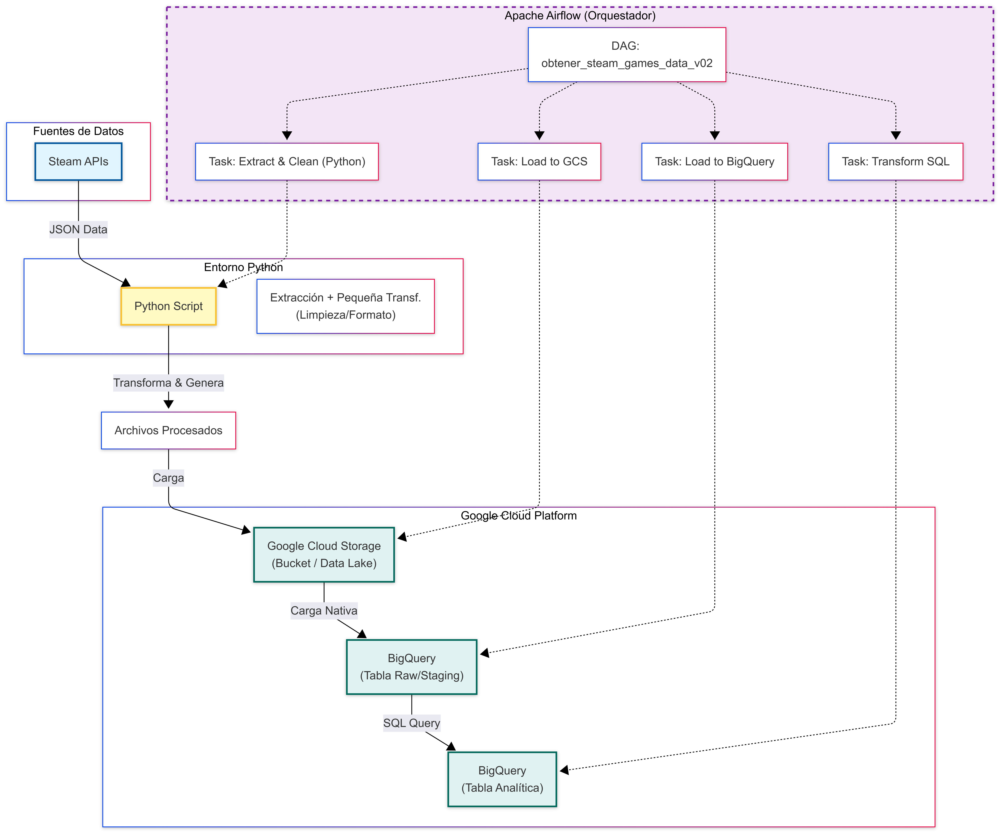
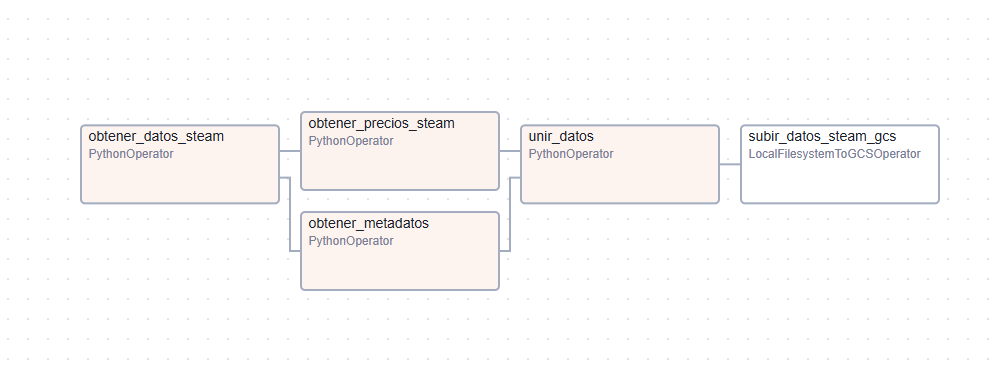

# Steam Data Pipeline con Airflow

Este proyecto implementa un pipeline EtTL (Extract, pequeña transformacion, Load, Transform) para extraer datos de videojuegos desde la API de Steam, procesarlos y generar un dataset unificado. Utiliza Apache Airflow orquestado con Docker.



## 📋 Prerrequisitos

Antes de comenzar, asegúrate de tener instalado:
- **Docker** y **Docker Compose**.
- Una **Steam Web API Key**. Puedes obtenerla gratuitamente en [https://steamcommunity.com/dev/apikey](https://steamcommunity.com/dev/apikey).

## 🚀 Instalación y Configuración

### 1. Clonar el repositorio
Descarga este proyecto en tu máquina local.

### 2. Configurar Credenciales

#### Steam API Key
Actualmente, la API Key está configurada en el script de extracción.
1. Abre el archivo `airflow/dags/plugins/extract_games.py`.
2. Busca la llamada a la función `get_all_steam_games` al final del archivo.
3. Reemplaza `'7F0CED09D773F260B336D65553BEDF2D'` con tu propia API Key si es necesario.

#### Google Cloud Credentials (Opcional)
Si planeas subir los datos a Google Cloud Storage (GCS):
1. Coloca tu archivo de credenciales JSON de Google Cloud en `airflow/google_credentials.json`.
2. Asegúrate de que el archivo se llame exactamente `google_credentials.json`.

### 3. Construir y Levantar Contenedores
Este proyecto utiliza una imagen personalizada de Airflow para incluir `steamcmd` (necesario para extraer metadatos).

Desde la carpeta `airflow/`:

```bash
# 1. Construir la imagen personalizada (SOLO LA PRIMERA VEZ o si cambias el Dockerfile)
docker-compose build

# 2. Iniciar los servicios
docker-compose up -d
```

Esto iniciará el Webserver, Scheduler y Postgres.

## ▶️ Ejecución

1. Abre tu navegador y ve a [http://localhost:8080](http://localhost:8080).
2. Inicia sesión con las credenciales por defecto (usualmente `airflow` / `airflow` si no se han cambiado en el docker-compose).
3. Busca el DAG llamado **`obtener_steam_games_data_v01`**.
4. Activa el DAG (toggle a "On") y ejecútalo manualmente (botón "Play").

### Graph del DAG


## ☁️ Infraestructura como Código (Terraform)

Este proyecto incluye configuración de Terraform para aprovisionar automáticamente los recursos necesarios en Google Cloud Platform (GCS Bucket y BigQuery Dataset).

### Configuración

1.  **Instalar Terraform**: Asegúrate de tener Terraform instalado en tu máquina.
2.  **Credenciales GCP**:
    *   Crea una Service Account en GCP con permisos de `Storage Admin` y `BigQuery Admin`.
    *   Descarga la llave JSON y guárdala en `terraform/keys/my-creds.json`.
3.  **Variables**:
    *   Abre `terraform/variables.tf` y ajusta los valores por defecto (Project ID, Region, Bucket Name, etc.) o crea un archivo `terraform.tfvars` con tus propios valores.

### Despliegue

Desde la carpeta `terraform/`:

```bash
# 1. Inicializar Terraform (descarga providers)
terraform init

# 2. Ver el plan de ejecución (qué se va a crear)
terraform plan

# 3. Aplicar los cambios (crear recursos en la nube)
terraform apply
```

---

## ⚠️ Rendimiento y Escalabilidad

**Nota Importante:** El proceso completo de extracción de datos (especialmente precios y metadatos para +150,000 juegos) **puede tomar varios días** en completarse debido a los límites de velocidad (Rate Limits) de la API de Steam y SteamCMD.

### Limitaciones Actuales
- **API Rate Limits:** Steam bloquea temporalmente las IPs que hacen demasiadas peticiones en poco tiempo.
- **Procesamiento Secuencial:** Aunque usamos Airflow, las tareas de extracción corren en un solo worker y deben respetar pausas (`sleep`) para evitar bloqueos.

### Futuras Mejoras para Escalar (Roadmap)
Para reducir el tiempo de ejecución en futuros proyectos o iteraciones, se proponen las siguientes soluciones:

1.  **Rotación de IPs / Proxies:** Utilizar una red de proxies para distribuir las peticiones y evitar el bloqueo por IP única.
2.  **Paralelismo Distribuido (Spark/Dask):** Reemplazar los scripts de Python secuenciales por trabajos distribuidos en un clúster (Dataproc o EMR) para procesar lotes en paralelo.
3.  **Cloud Functions / Lambdas:** Disparar cientos de funciones serverless en paralelo para consultar la API (aunque requiere gestión compleja de IPs).
4.  **Particionamiento:** Dividir la lista de juegos en "shards" y ejecutar múltiples DAGs o tareas en paralelo, cada uno encargado de un rango de IDs.

---

## 📂 Estructura del Proyecto

- **`airflow/dags/`**: Contiene la definición del DAG (`get_steam_games.py`).
- **`airflow/dags/plugins/`**: Scripts Python con la lógica ETL:
  - `extract_games.py`: Descarga la lista completa de juegos.
  - `extract_game_prices.py`: Consulta precios por país.
  - `extraer_game_genres_publishers.py`: Usa `steamcmd` para obtener desarrolladores y géneros.
  - `join_steam_data.py`: Une todo en un archivo final.
- **`airflow/raw_data/`**: Carpeta donde se guardan los datos crudos intermedios (mapeada al host).
- **`airflow/dags/data/`**: Carpeta donde se guarda el resultado final `steam_final.json`.

## 🛠️ Solución de Problemas Comunes

- **Error de permisos en `raw_data`**: Asegúrate de que la carpeta `airflow/raw_data` tenga permisos de escritura.
- **Logs no visibles**: Si no puedes ver los logs de las tareas, asegúrate de estar usando `LocalExecutor` en el `docker-compose.yaml` para desarrollo local.
- **SteamCMD falla**: Verifica que la imagen se haya construido correctamente con `docker-compose build`.

## 📦 Output

El resultado final será un archivo JSON ubicado en `airflow/dags/data/steam_final.json` con la información consolidada de los juegos, precios y metadatos.

---

## 🔄 Próximos Pasos: Transformación y Carga (BigQuery)

Actualmente, el pipeline finaliza con la generación del archivo `steam_final.json`. Este archivo contiene estructuras anidadas (como el diccionario de precios por país) que deben ser "aplanadas" para su análisis eficiente en un Data Warehouse.

**Esta etapa de transformación está pendiente de implementación.** A continuación, se describen dos estrategias recomendadas para abordarla:

### Opción 1: Transformación con Python (Pandas/Spark)
Antes de cargar a BigQuery, se procesa el JSON para generar un formato tabular (CSV o Parquet).
1.  **Leer JSON:** Cargar `steam_final.json` en un DataFrame.
2.  **Aplanar (Flatten):** Usar `json_normalize` o `explode` para convertir la estructura anidada de precios (`{'us': 10, 'cl': 5000}`) en filas individuales o columnas específicas.
3.  **Exportar:** Guardar como Parquet (recomendado por eficiencia y esquema).
4.  **Cargar:** Subir el Parquet a GCS y de ahí a BigQuery.

### Opción 2: ELT con BigQuery y DBT (Recomendada)
Cargar el dato "crudo" y transformar usando SQL dentro del Data Warehouse.
1.  **Carga Raw:** Subir `steam_final.json` directamente a GCS y cargarlo en una tabla "Raw" en BigQuery (usando el tipo de dato `JSON` o `STRING`).
2.  **Transformación SQL (DBT):** Crear modelos DBT que lean la tabla Raw.
    *   Usar funciones como `JSON_EXTRACT` o `UNNEST` para parsear la estructura.
    *   Crear tablas finales limpias (`dim_games`, `fact_prices`) listas para análisis.
